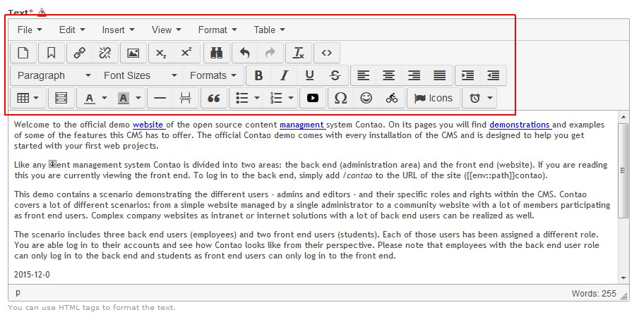

Contao Extension: RscTinyMceZUpAll
==================================

Special RSC TinyMCE setup which creates the toolbars with all known buttons.

For more information see [TinyMcePluginLoader](https://github.com/cliffparnitzky/TinyMcePluginLoader).

Installation
------------

Install the extension via composer: [rsclg/tiny-mce-setup-all](https://packagist.org/packages/rsclg/tiny-mce-setup-all).

If you prefer to install it manually, download the latest release here: https://github.com/rsclg/RscTinyMceZUpAll/releases

Tracker
-------

https://github.com/rsclg/RscTinyMceZUpAll/issues

Compatibility
-------------

- min. Contao version: >= 3.3.0
- max. Contao version: <  3.6.0

Dependency
----------

All dependent plugins from [TinyMceBundleAll](https://github.com/cliffparnitzky/TinyMceBundleAll) and [rsclg/tiny-mce-triathlon-icons](https://packagist.org/packages/rsclg/tiny-mce-triathlon-icons) have to be installed.

Screenshot
----------

Additional information
----------------------

### Special notes

It is not possible to use several setups at the same time. If more than one setup is installed, one may only be active in the system settings.

### Information in the wiki

#### Create a new ...

* [Creating a new plugin](https://github.com/cliffparnitzky/TinyMcePluginLoader/wiki/Creating-a-new-plugin)
* [Creating a new bundle](https://github.com/cliffparnitzky/TinyMcePluginLoader/wiki/Creating-a-new-bundle)
* [Creating a new setup](https://github.com/cliffparnitzky/TinyMcePluginLoader/wiki/Creating-a-new-setup)

#### Installation hints
* [Install manually](https://github.com/cliffparnitzky/TinyMcePluginLoader/wiki/Install-manually)

#### Bug report hints

* [Report a bug](https://github.com/cliffparnitzky/TinyMcePluginLoader/wiki/Report-a-bug)